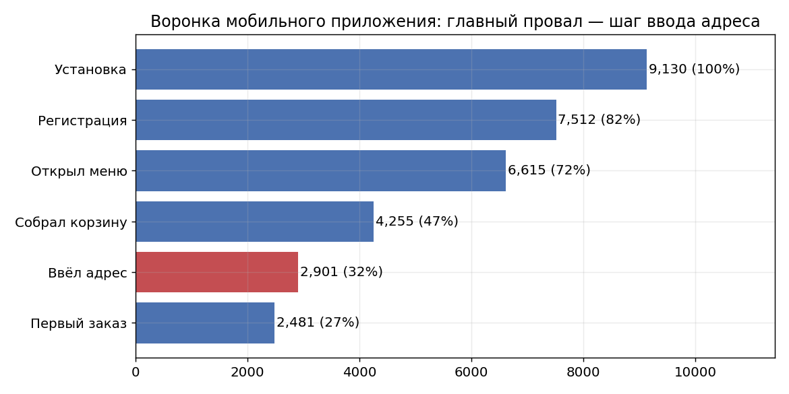
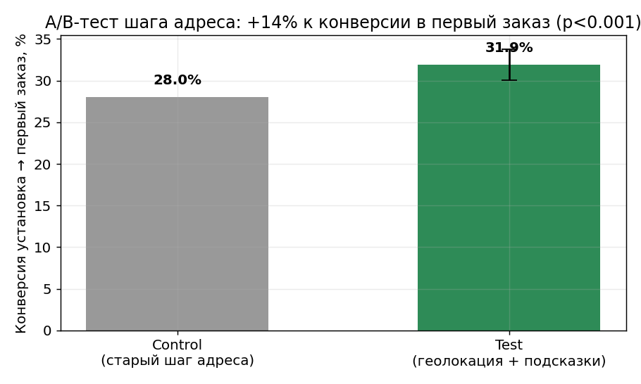
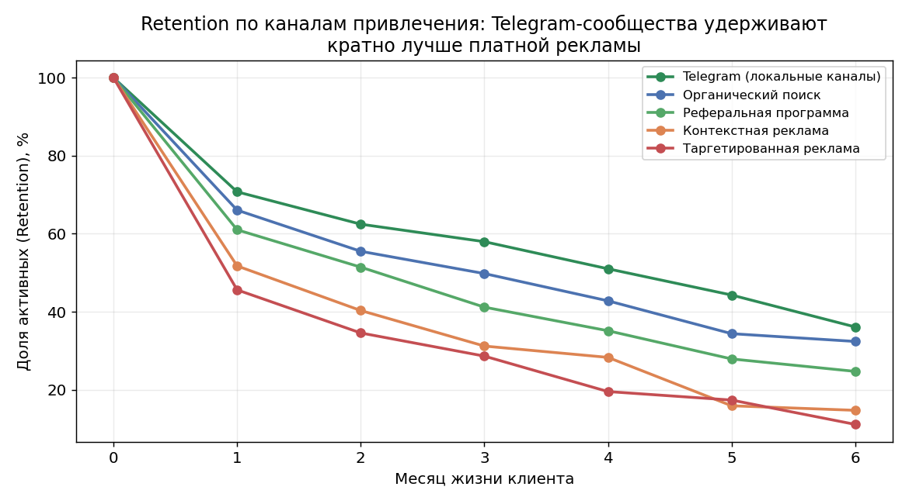
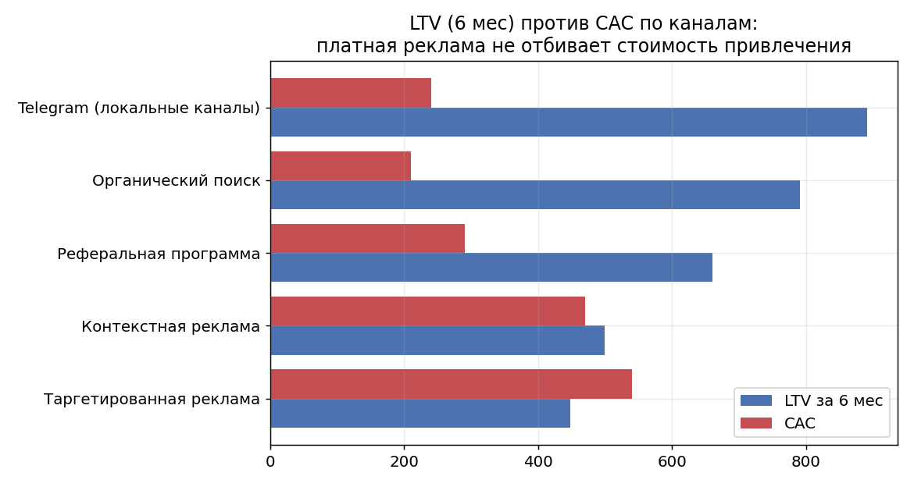

# Кейс: продуктовая аналитика приложения доставки еды

**Роль:** продуктовый аналитик (внешний, полный цикл) · **Период:** апрель 2025 – май 2026. · **Клиент:** Foodster - доставка еды, мобильное приложение (запуск франшизы в Элисте)

> ⚠️ **Данные клиента под NDA.** Для публичной демонстрации методологии структура данных
> воссоздана синтетически ([`generate_data.py`](generate_data.py)) с сохранением характера
> реальных закономерностей. Цифры иллюстративные, выводы и порядок величин соответствуют
> реальному кейсу. В оригинальном проекте данные выгружались через SQL, дашборд собирался
> в Power BI, результаты презентовались клиенту в PowerPoint.

## Бизнес-контекст

Foodster запускал франшизу доставки еды в новом городе, то есть в Элисте, где и находится офис Changes, в котором я работал. Я был единственным аналитиком
на проекте и закрывал полный цикл продуктовой аналитики. Клиент пришёл с двумя задачами:

1. Пользователи устанавливают приложение, но многие не доходят до первого заказа - **где теряются?**
2. Маркетинговый бюджет размазан по каналам - **какие каналы реально окупаются?**

## Задача 1: воронка приложения и A/B-тест

**Анализ воронки** (установка → регистрация → меню → корзина → адрес → заказ) выявил
главный провал: **~32% пользователей, собравших корзину, отваливаются на шаге ввода
адреса доставки** - ручной ввод адреса на телефоне неудобен, пользователи ошибаются
и бросают корзину.



**Гипотезу проверил A/B-тестом:** геолокация + подсказки при вводе + сохранение истории
адресов против старого ручного ввода (рандомизация 50/50). Результат - **+14% к конверсии
в первый заказ** (z = 4.2, p < 0.001, 95% CI разницы [+2.1; +5.7] п.п.). Решение раскатано
на всех пользователей.



## Задача 2: качество каналов и юнит-экономика

**Retention по каналам** показал, что каналы сильно различаются по качеству аудитории:
пользователи из локальных **Telegram-сообществ удерживаются в ~2 раза лучше**, чем из
таргетированной рекламы (тёплая лояльная аудитория против «холодного» платного трафика).



**Юнит-экономика (LTV vs CAC)** вскрыла, что бюджет работал неэффективно:

| Канал | CAC | LTV (6 мес) | Окупаемость |
|---|---|---|---|
| Органический поиск | 210 ₽ | 791 ₽ | 1 мес |
| Telegram-сообщества | 240 ₽ | 892 ₽ | 1 мес |
| Реферальная программа | 290 ₽ | 661 ₽ | 2 мес |
| Контекстная реклама | 470 ₽ | 500 ₽ | 6 мес |
| **Таргетированная реклама** | **540 ₽** | **448 ₽** | **не окупается за 6 мес** |



**Рекомендация:** сдвинуть бюджет от таргета и контекста в сторону Telegram-сообществ,
органики и рефералки. Эффект - **средневзвешенный CAC −15%** при том же объёме привлечения
и более лояльной клиентской базе.

## Результаты

| Задача | Результат |
|---|---|
| Поиск потерь в воронке | Найден главный провал: ~32% оттока на шаге ввода адреса |
| A/B-тест упрощённого шага адреса | **+14% к конверсии в первый заказ**, статзначимо, раскатано на всех |
| Retention-анализ каналов | Telegram-сообщества удерживают ~×2 к таргету |
| Юнит-экономика и перераспределение бюджета | Таргет не окупается за 6 мес → **CAC −15%** |

## Структура репозитория

```
├── README.md            — этот файл
├── generate_data.py     — генератор синтетического датасета (закономерности вшиты)
├── analysis.ipynb       — основной ноутбук: воронка, A/B-тест, Retention, юнит-экономика
├── users.csv            — синтетика: пользователи, воронка, A/B-группы (14K строк)
├── retention.csv        — синтетика: помесячный Retention по каналам
├── unit_economics.csv   — синтетика: CAC, LTV, окупаемость по каналам
└── charts/              — ключевые графики
```

**Стек оригинального проекта:** SQL, Power BI, PowerPoint.
**Стек демонстрации:** Python — pandas, numpy, matplotlib, scipy.

Запуск: `python generate_data.py && jupyter notebook analysis.ipynb`
