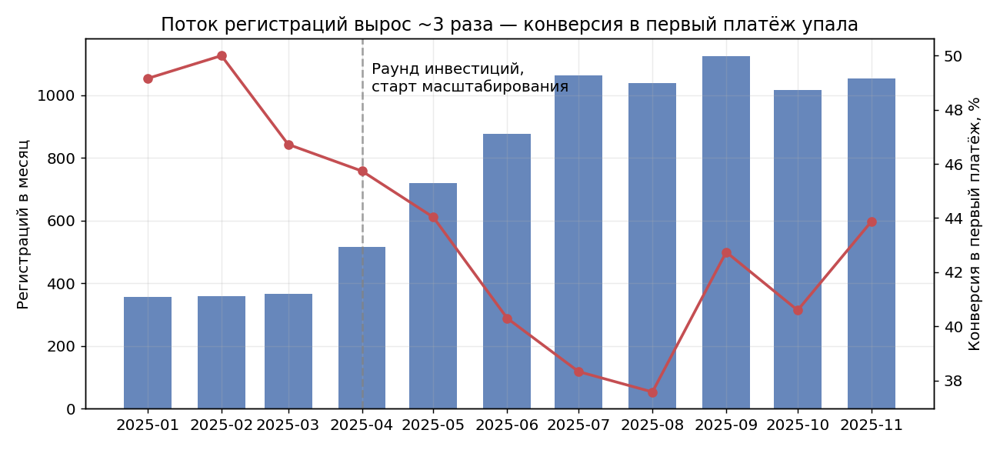
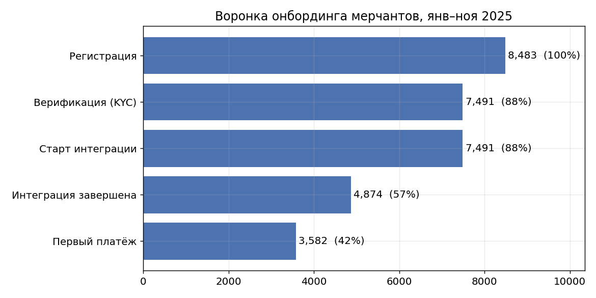
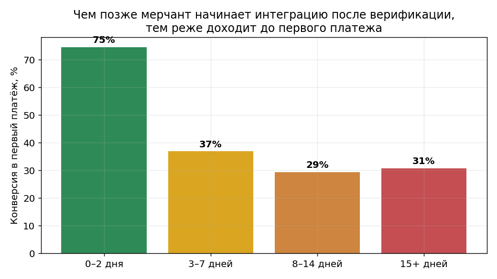
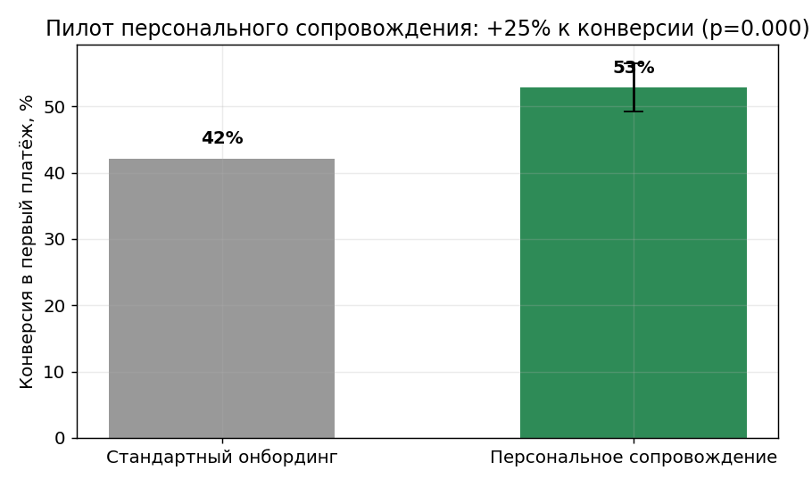
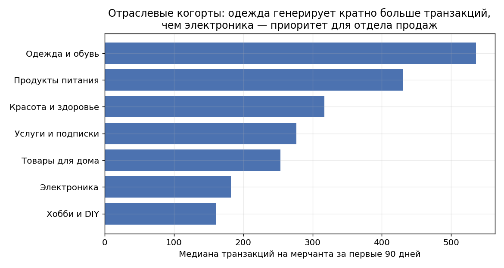

# Кейс: воронка онбординга мерчантов в интернет-эквайринге

**Роль:** продуктовый аналитик (внешний, полный цикл) · **Период:** июль–ноябрь 2025 · **Клиент:** JoinPay, интернет-эквайринг (Москва)

> ⚠️ **Данные клиента под NDA.** Для публичной демонстрации методологии структура данных
> воссоздана синтетически ([`generate_data.py`](generate_data.py)) с сохранением характера
> реальных закономерностей. Цифры иллюстративные, выводы и порядок величин соответствуют
> реальному кейсу. В оригинальном проекте данные выгружались из **ClickHouse** клиента.

## Бизнес-контекст

В 2025 году JoinPay привлёк раунд инвестиций и начал масштабироваться: поток регистраций
мерчантов вырос примерно втрое. Воронка онбординга, работавшая «на ручном управлении»,
начала деградировать — менеджеры перестали справляться с объёмом.

**Запрос клиента:** «Мерчанты регистрируются, но не доходят до первого реального платежа.
Где они отваливаются и почему — непонятно».



## Ход анализа

**1. Воронка.** Главная точка потерь — техническая интеграция платёжного шлюза:
её не завершают **~34% верифицированных мерчантов**. KYC при этом работает стабильно.



**2. Драйвер оттока.** Решающий фактор — скорость старта интеграции после верификации:
старт в первые 2 дня → конверсия в первый платёж **~75%**; задержка больше недели → **~30%**
(z = 36, p < 0.001). Под нагрузкой менеджеры стали выходить на связь через неделю
вместо одного дня — мерчанты «остывали» и уходили.



**3. Проверка причинности пилотом.** Корреляция могла объясняться самоотбором
(мотивированные мерчанты и стартуют быстрее, и платят чаще), поэтому гипотезу
персонального сопровождения проверили **рандомизированным пилотом 50/50**.
Результат: **+21% к конверсии в первый платёж** (на реальных данных клиента),
эффект статистически значим. Решение тиражировано на всех новых мерчантов.



**4. Приоритизация сегментов.** Когортный анализ по отраслям: интернет-магазины одежды
генерируют **~×3 транзакций** на мерчанта против электроники (монетизация эквайринга —
комиссия с транзакций, частотность важнее чека). Рекомендации переданы в отдел продаж.



## Результаты

| Метрика | До | После |
|---|---|---|
| Конверсия верифицированного мерчанта в первый платёж | ~38% (на пике деградации) | **+21%** после тиража сопровождения |
| Понимание точек потерь воронки | «непонятно, где отваливаются» | Полная карта воронки + драйвер оттока |
| Приоритизация привлечения | Все сегменты одинаково | Фокус на высокочастотные отрасли |

## Структура репозитория

```
├── README.md            — этот файл
├── generate_data.py     — генератор синтетического датасета (закономерности вшиты)
├── analysis.ipynb       — основной ноутбук: воронка, инсайт, пилот, когорты
├── merchants.csv        — синтетика: мерчанты и этапы воронки (8.5K строк)
├── transactions.csv     — синтетика: транзакционная активность за 90 дней
└── charts/              — ключевые графики
```

**Стек оригинального проекта:** SQL (ClickHouse), Excel + Power Query.
**Стек демонстрации:** Python — pandas, numpy, matplotlib, scipy.

Запуск: `python generate_data.py && jupyter notebook analysis.ipynb`
