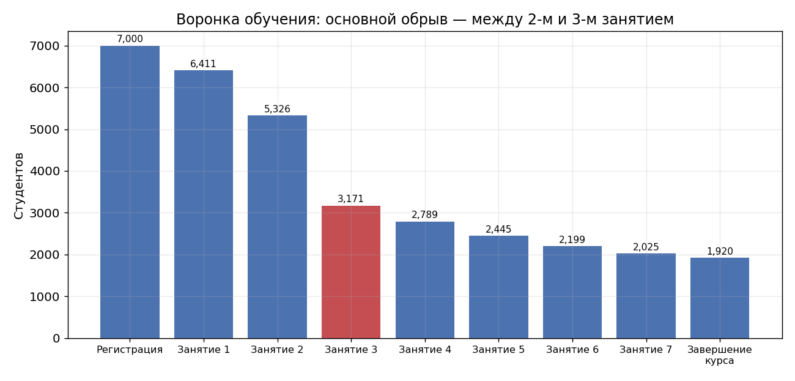
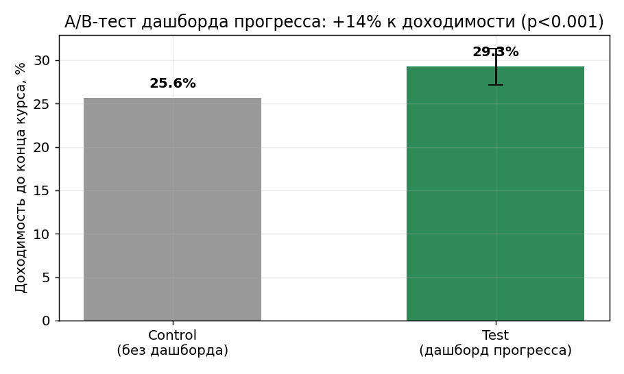
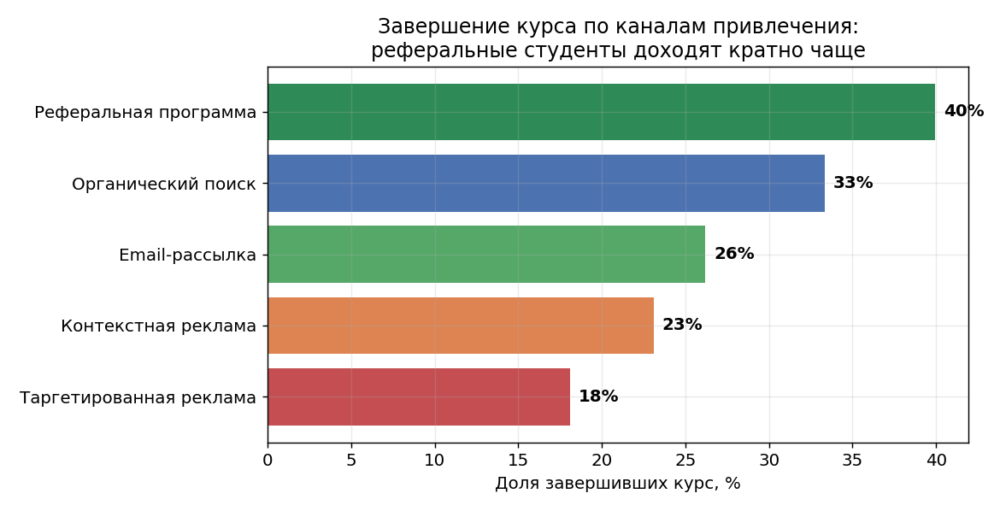

# Кейс: доходимость до конца курса в онлайн-школе

**Роль:** продуктовый аналитик (внешний, самостоятельное ведение) · **Период:** октябрь 2024 — апрель 2025 · **Клиент:** «Облака» — EdTech, онлайн-школа (Санкт-Петербург)

> ⚠️ **Данные клиента под NDA.** Для публичной демонстрации методологии структура данных
> воссоздана синтетически ([`generate_data.py`](generate_data.py)) с сохранением характера
> реальных закономерностей. Цифры иллюстративные, выводы и порядок величин соответствуют
> реальному кейсу.

## Бизнес-контекст

«Облака» — онлайн-школа с курсами из нескольких занятий. Это был мой первый проект
в самостоятельном ведении: единственный аналитик на клиенте, полный цикл продуктовой
аналитики. Стандартная для EdTech боль — низкая доходимость до конца курса (course
completion): слабый образовательный результат, риск для повторных продаж и репутации.

**Две задачи:**
1. Где студенты бросают обучение — и можно ли это исправить продуктом?
2. Какие каналы привлечения приводят студентов, которые реально доходят до конца?

## Задача 1: воронка обучения и A/B-тест

**Анализ воронки** (регистрация → занятия 1–8 → завершение) выявил главный обрыв:
**~40% студентов отсеиваются между 2-м и 3-м занятием**, тогда как остальные переходы
держатся на 85–95%. Это точечный обрыв, а не равномерное вытекание — значит, у него
есть конкретная причина.



Разбор показал типичную EdTech-механику: к 3-му занятию стартовая мотивация угасает,
курс ещё не дал ощутимого результата, прогресс не виден — студент бросает.

**Гипотезу проверил A/B-тестом:** дашборд прогресса (пройдено/осталось) + еженедельная
рассылка с результатами против отсутствия изменений (рандомизация 50/50). Результат —
**+15% к доходимости до конца курса** (z = 3.4, p < 0.001, 95% CI [+1.5; +5.7] п.п.).
Решение внедрено.



## Задача 2: качество каналов привлечения

В EdTech важна не цена лида, а его качество: студент, бросивший после 2-го занятия,
не приносит ни результата, ни повторных продаж. Поэтому каналы сравнивались по доле
завершивших курс, а не по стоимости регистрации.

**Студенты из реферальной программы завершают курс примерно в 2 раза чаще, чем из
таргетированной рекламы** — по рекомендации друга приходит мотивированный человек
с осознанным запросом, таргет же приводит «холодную» аудиторию с импульсивными записями.



**Рекомендация:** сместить бюджет привлечения в пользу реферальной программы и органики.
По итогам клиент перераспределил бюджет в сторону реферального канала.

## Результаты

| Задача | Результат |
|---|---|
| Поиск обрыва в воронке | Найден главный обрыв: ~40% отсева между 2-м и 3-м занятием |
| A/B-тест дашборда прогресса | **+15% к доходимости до конца курса**, статзначимо, внедрено |
| Анализ каналов привлечения | Реферальная программа даёт ~×2 завершений к таргету → перераспределение бюджета |

## Структура репозитория

```
├── README.md            — этот файл
├── generate_data.py     — генератор синтетического датасета (закономерности вшиты)
├── analysis.ipynb       — основной ноутбук: воронка, A/B-тест, анализ каналов
├── students.csv         — синтетика: студенты, прогресс по занятиям, A/B-группы (7K строк)
└── charts/              — ключевые графики
```

**Стек оригинального проекта:** SQL, дашборды, A/B-тесты.
**Стек демонстрации:** Python — pandas, numpy, matplotlib, scipy.

Запуск: `python generate_data.py && jupyter notebook analysis.ipynb`
