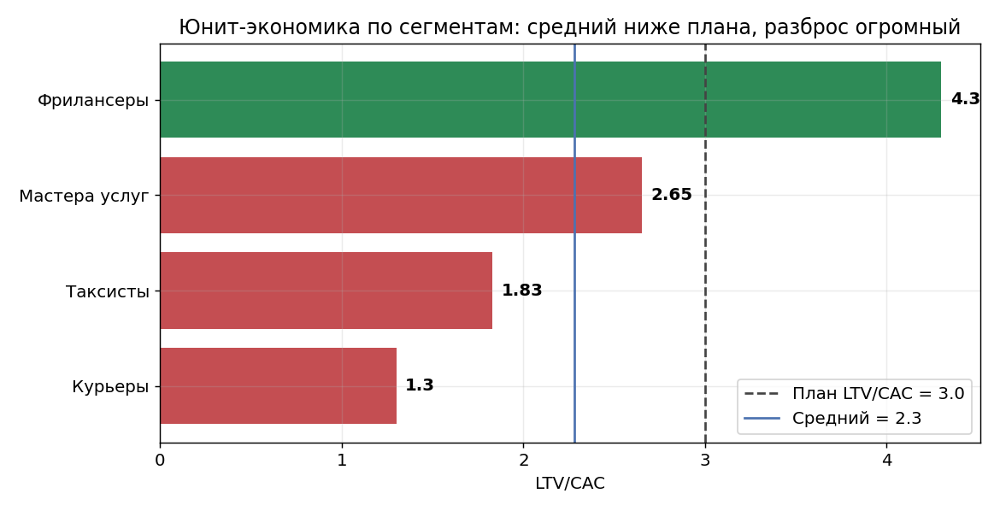
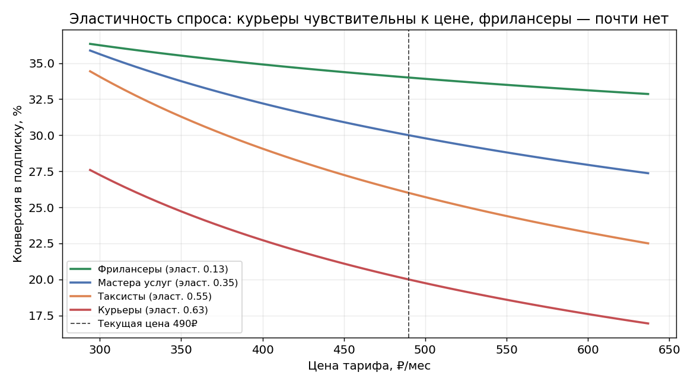
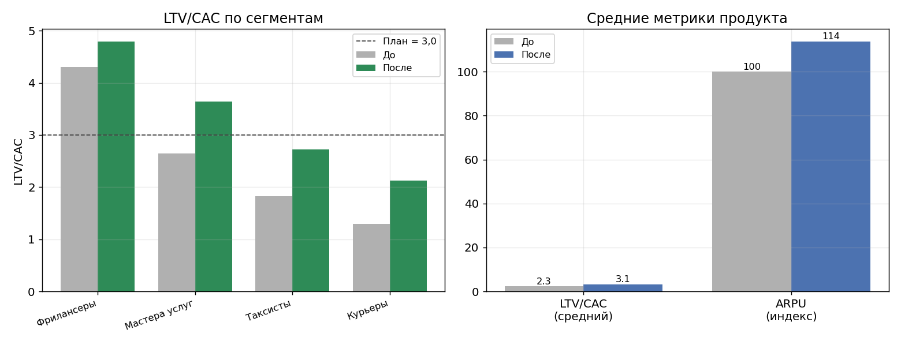

# Кейс: юнит-экономика и монетизация тарифа для самозанятых

**Роль:** продуктовый аналитик (внешний, направление юнит-экономики и монетизации) · **Период:** 2024–2025 · **Клиент:** «Точка» — финтех, банк для предпринимателей

> ⚠️ **Данные клиента под NDA.** Для публичной демонстрации методологии структура и цифры
> воссозданы синтетически ([`generate_data.py`](generate_data.py)) с сохранением характера
> реальных закономерностей. Значения иллюстративные, выводы и порядок величин соответствуют
> реальному кейсу.

## Бизнес-контекст

«Точка» запускала тариф «Точка Старт» для самозанятых. Я вёл направление юнит-экономики
и монетизации на всём цикле — от pre-launch до масштабирования, в паре с аналитиком равного
уровня. Тариф был единым для всех, но самозанятые — очень разная аудитория (курьеры,
таксисты, фрилансеры, мастера услуг), и это оказалось ключевым.

**Задачи:**
1. Окупается ли продукт и где теряется экономика?
2. Что делать с ценой и тарифной сеткой, чтобы вывести продукт в целевую окупаемость?

## Задача 1: юнит-экономика по сегментам

Посчитал по каждому сегменту CAC, ARPU (цена тарифа + допуслуги), LTV на горизонте 12 месяцев
с учётом оттока, LTV/CAC и срок окупаемости.



**Продукт в среднем не выходит на целевую окупаемость: LTV/CAC ≈ 2,2 при плане 3,0.** Но средняя
цифра скрывает главное — **разброс между сегментами огромный:**

- **Фрилансеры** — LTV/CAC ≈ 4,3, окупаются за 3 месяца: активно пользуются допуслугами, низкий отток.
- **Курьеры** — LTV/CAC ≈ 1,3, окупаются только к 7-му месяцу: используют счёт пассивно, почти
  не подключают допуслуги, высокий отток. Именно они тянут среднюю вниз.

Вывод: единый тариф не подходит для настолько разной аудитории. Проблема не в продукте целиком,
а в том, что курьеры на общих условиях не окупаются.

## Задача 2: ценовая эластичность спроса

Прежде чем менять цену, оценил, как сегменты реагируют на её изменение — ценовую эластичность
спроса (насколько меняется конверсия в подписку при изменении цены).



**Сегменты реагируют на цену принципиально по-разному:**

- **Фрилансеры — спрос почти неэластичен:** снижение цены на 20% почти не меняет конверсию (+3%).
  Цену для них можно не трогать.
- **Курьеры — спрос эластичен:** снижение цены на 20% поднимает конверсию в подписку примерно
  на **15%**. Для них цена — реальный барьер.

Это прямо подсказало решение: не единый тариф, а сегментная тарифная сетка.

## Задача 3: новая тарифная сетка и A/B-тест

На основе юнит-экономики и эластичности совместно с продакт-менеджером «Точки» разработали
новую тарифную сетку: базовый тариф для большинства + облегчённый тариф для курьеров (−20%).
Гипотеза: посильный тариф повысит и конверсию, и удержание курьеров. Проверили **A/B-тестом**
и двумя месяцами мониторинга.



**Результат:**

- Средневзвешенный **LTV/CAC вырос с ≈2,2 до ≈3,0** — продукт вышел на целевую окупаемость.
- **ARPU вырос примерно на 12–14%** — за счёт роста удержания и допподключений.
- Курьеры перестали тянуть экономику вниз: на посильном тарифе они дольше остаются и активнее
  пользуются допуслугами.

Ключ был не в том, чтобы «поднять или снизить цену» в лоб, а в том, чтобы **дать каждому сегменту
подходящие условия**: нечувствительным к цене — сохранить, чувствительным — облегчить.

## Результаты

| Задача | Результат |
|---|---|
| Окупается ли продукт | Средний LTV/CAC ≈2,2 при плане 3,0; курьеры (LTV/CAC 1,3) тянут вниз |
| Реакция спроса на цену | Фрилансеры неэластичны, курьеры эластичны (−20% цены → +15% конверсии) |
| Вывод в окупаемость | **LTV/CAC ≈2,2 → ≈3,0, ARPU +12–14%, окупаемость сократилась** |

## Структура репозитория

```
├── README.md                    — этот файл
├── generate_data.py             — генератор синтетического датасета (закономерности вшиты)
├── analysis.ipynb               — основной ноутбук: юнит-экономика, эластичность, тарифная сетка
├── users.csv                    — синтетика: подписчики тарифа по сегментам (9K строк)
├── unit_economics_start.csv     — юнит-экономика по сегментам на старте
├── before_after.csv             — сравнение метрик до/после
└── charts/                      — ключевые графики
```

**Стек оригинального проекта:** SQL, Power BI, финансовое моделирование.
**Стек демонстрации:** Python — pandas, numpy, matplotlib.

Запуск: `python generate_data.py && jupyter notebook analysis.ipynb`
